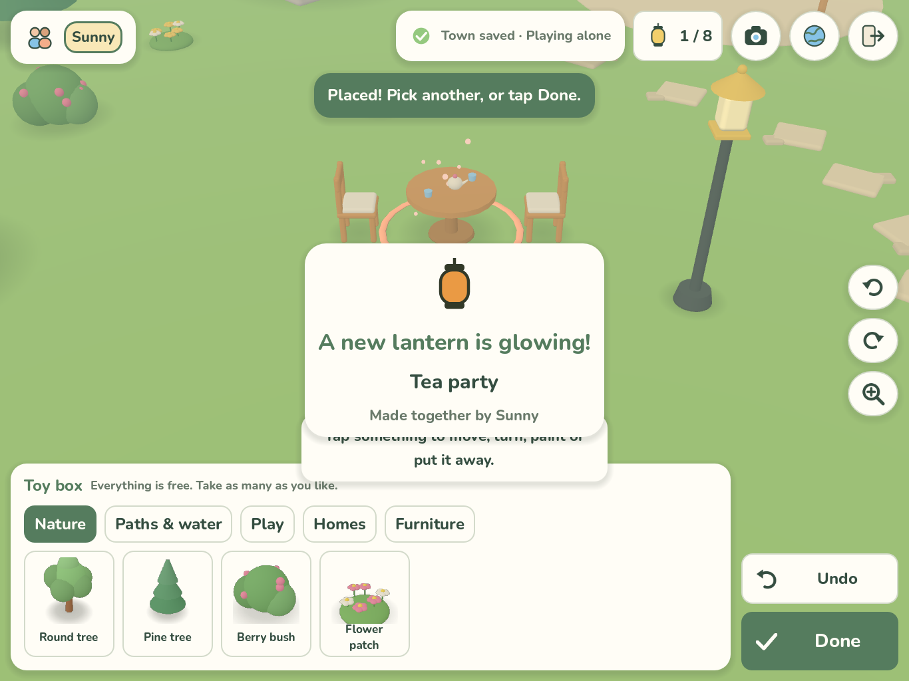

# Lantern Lane

A cozy 3D iPad game built with **Godot 4.7.2**, in which two to four children decorate a shared town from their own homes. They place cottages, gardens, ponds, swings and furniture, form **Cozy Spots** that light lanterns on the Wishing Tree, and play in what they build. Everything in the toy box is free from the start.

- Game design: [docs/game-design.md](docs/game-design.md)
- Handoff (status, tests, remaining issues): [HANDOFF.md](HANDOFF.md)
- Multiplayer approach: [docs/multiplayer.md](docs/multiplayer.md)
- Development environment report: [docs/environment-report.md](docs/environment-report.md)
- Requirements and history: [docs/requirements.md](docs/requirements.md) · Validation record: [docs/validation.md](docs/validation.md)



## Repository layout

```text
game/                 Godot project (open game/project.godot)
  scripts/core/       Pure game rules: catalog, town model, Cozy Spots, avatars, palette
  scripts/net/        Session autoload: solo, host, client and dedicated server
  scripts/world/      3D town, camera, local player and decorating controller
  scripts/art/        Procedural toy-like models for props and children
  scripts/ui/         HUD, menus, theme/icons, catalog thumbnails
  scripts/autoload/   Localization (six languages) and synthesized sounds
  locale/             UI catalogs: en, zh-CN, ja, es, fr, de (English is the source)
  assets/fonts/       OFL fonts (Nunito; M PLUS Rounded 1c and Noto Sans SC subsets)
  tests/              Unit/session tests, rendered tour, network bots, probes
  export_presets.cfg  Generic iPad export preset (placeholder bundle ID, no Team ID)
design/               Earlier browser design preview and concept art (reference only)
docs/                 Design, requirements, validation, environment and multiplayer notes
scripts/              Tool setup, Godot wrapper, test runners, string and font tools
```

## Open and run

On a Mac or PC with Godot 4.7.2: open `game/project.godot` and press Play. On this Linux host, use the project-local tools:

```sh
scripts/setup_tools.sh                     # Godot 4.7.2 + Python venv + fonts into tools/ (git-ignored)
scripts/godot.sh --path game               # run the game (needs a display; on EC2 prefix: xvfb-run -a)
scripts/godot.sh --headless --path game -- --server --port=9080   # dedicated town server
```

Desktop controls for testing: click or tap the ground to walk; WASD/arrows to walk; Q/E rotate the view; Z zoom; Space for the context action; R turn, Enter place, Esc cancel, Ctrl+Z undo; keys 1–4 for emotes.

## Tests

```sh
scripts/test_all.sh            # everything (rendered tour needs xvfb-run)
scripts/test_all.sh --quick    # repository checks + headless unit/session tests
```

| Check | Command |
|---|---|
| Repository: locales, placeholders, extracted UI strings, font coverage, English sources, links | `tools/venv/bin/python scripts/check.py` |
| Rules, saves, Cozy Spots, avatars, locales, solo session | `scripts/godot.sh --headless --path game -s res://tests/run_tests.gd` |
| Multiplayer with real WebSocket client processes, persistence across server restart | `python3 scripts/net_test.py` |
| Rendered end-to-end tour with screenshots in six languages | see `scripts/test_all.sh` |

Screenshots from the rendered tests are in `docs/screenshots/godot/`. They come from a software renderer on a headless server. They are not iPad verification or final visual acceptance.

## Languages

English (default), Simplified Chinese, Japanese, Spanish, French and German. Change language from the globe button on the title screen or in game. After changing UI text, run `tools/venv/bin/python scripts/extract_strings.py` to find untranslated strings, and run `scripts/build_fonts.py` to refresh the CJK font subsets.

## Design preview

The earlier browser preview is still available: run `python3 -m http.server 8769 --bind 127.0.0.1` and open `design/index.html`. It is reference material only.
