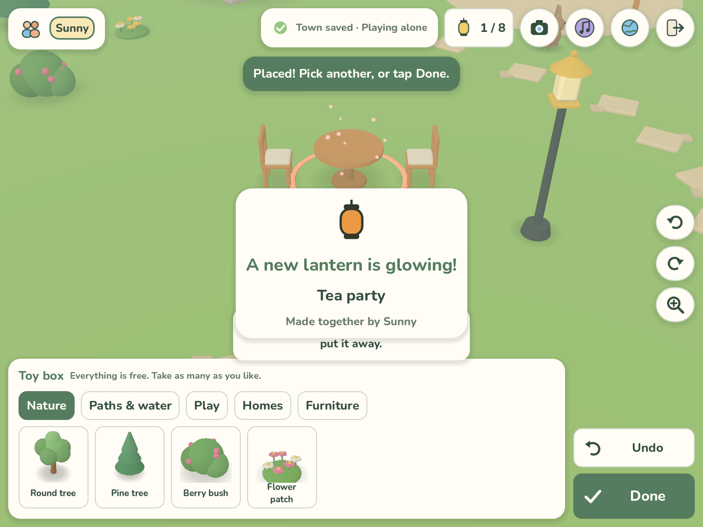

# Lantern Lane

A cozy 3D iPad and iPhone game built with **Godot 4.7.2**, in which two to four children decorate a shared town from their own homes. They place three-story cottages, gardens, ponds, swings and furniture (with a decoration on a table top), form **Cozy Spots** that light lanterns on the Wishing Tree, explore a 52 × 44 m countryside with five animal friends, and play in what they build, to a gentle original soundtrack. Eight optional activities invite play without quests or currency: animal wishes, hide-and-seek with a golden acorn, gift bundles, little gardens, a dance party, open-house hearts and guest books, photo ideas and weather. The toy box holds 163 items, 140 of them modeled furniture and decorations (including wall and ceiling items), all free from the start.

- Game design: [docs/game-design.md](docs/game-design.md) · Animal friends: [docs/animals.md](docs/animals.md)
- Object scale and table-top contract: [design/object-scale-and-surfaces.md](design/object-scale-and-surfaces.md)
- Activities A-H: [design/playfulness-proposals.md](design/playfulness-proposals.md) · Model release r1 coverage and next-run guide: [design/model-release-r1.md](design/model-release-r1.md)
- Asset provenance and licenses: [docs/assets.md](docs/assets.md) · Contributing (keep docs current with every change): [CONTRIBUTING.md](CONTRIBUTING.md)
- Handoff (status, tests, remaining issues): [HANDOFF.md](HANDOFF.md)
- Multiplayer approach: [docs/multiplayer.md](docs/multiplayer.md)
- Development environment report: [docs/environment-report.md](docs/environment-report.md)
- Requirements and history: [docs/requirements.md](docs/requirements.md) · Validation record: [docs/validation.md](docs/validation.md)



## Repository layout

```text
game/                 Godot project (open game/project.godot)
  scripts/core/       Pure game rules: catalog (scale contract), town model (rooms, table tops,
                      wall/ceiling mounts), Cozy Spots, animal brain, wishes, hide-and-seek,
                      photo ideas, avatars, palette
  scripts/net/        Session (solo, host, client, dedicated server), Animals and Activities autoloads
  scripts/world/      3D town, activity visuals, camera, local player and decorating controller
  scripts/art/        Procedural toy-like models for props and children
  scripts/ui/         HUD, menus, theme/icons, catalog thumbnails
  scripts/autoload/   Localization (six languages), music and settings, synthesized sounds
  assets/audio/       Original music loop (see docs/assets.md)
  assets/models/      140 modeled GLBs: 10 from art/pilot-10-v1, 130 from art/production-r1 (scale baked in)
  locale/             UI catalogs: en, zh-CN, ja, es, fr, de (English is the source)
  assets/fonts/       OFL fonts (Nunito; M PLUS Rounded 1c and Noto Sans SC subsets)
  tests/              Unit/session tests, rendered tour, network bots, probes
  export_presets.cfg  Generic iOS export preset "iPad" for iPhone and iPad (placeholder bundle ID, no Team ID)
art/pilot-10-v1/      Reviewed modeled furniture: GLBs, builders, manifests, modeling skill (rebuild.sh)
art/production-r1/    Release r1 models: release manifest, frozen batch records, builders, skill
design/               Earlier browser design preview, concept art and the object scale contract
docs/                 Design, requirements, validation, environment and multiplayer notes
scripts/              Tool setup, Godot wrapper, test runners, string, font and music tools
```

## Open and run

On a Mac or PC with Godot 4.7.2: open `game/project.godot` and press Play. On this Linux host, use the project-local tools:

```sh
scripts/setup_tools.sh                     # Godot 4.7.2 + Python venv + fonts into tools/ (git-ignored)
scripts/godot.sh --path game               # run the game (needs a display; on EC2 prefix: xvfb-run -a)
scripts/godot.sh --headless --path game -- --server --port=9080   # dedicated town server
```

Touch: tap the ground to walk; tap a door, stairs, swing, bench or animal to use it or say hello; Decorate opens the toy box, and dragging an item onto a table sets it on top. The placement tools jump to the top of the screen when they would cover the item. Desktop controls for testing: click the ground to walk; WASD/arrows to walk; Q/E rotate the view; Z zoom; Space for the context action; R turn, Enter place, Esc cancel, Ctrl+Z undo; keys 1–4 for emotes.

## Tests

```sh
scripts/test_all.sh            # everything (rendered tour needs xvfb-run)
scripts/test_all.sh --quick    # repository checks + headless unit/session tests
```

| Check | Command |
|---|---|
| Repository: locales, placeholders, extracted UI strings, font coverage, English sources, links | `tools/venv/bin/python scripts/check.py` |
| Music loop: format, length, headroom, loudness, seam | `python3 scripts/check_audio.py` |
| Placement tools never cover the item (three screen shapes, real drags) | see `scripts/test_all.sh` (`tests/dock_tour.gd`) |
| Rules, saves and migration, rooms and stairs, table tops, wall/ceiling mounts, scale contract and every modeled GLB, Cozy Spots, animals, activity rules (wishes, gifts, gardens, hearts and visits, photo ideas, hide-and-seek warmth), placement-tool logic, music settings, locales, solo session | `scripts/godot.sh --headless --path game -s res://tests/run_tests.gd` |
| Multiplayer with real WebSocket client processes, persistence across server restart | `python3 scripts/net_test.py` |
| Activities with real clients (conflicting starts, late joiner, presents, hearts, restart) | `python3 scripts/net_test.py --activities` |
| Rendered tour of the eight activities | `xvfb-run -a -s "-screen 0 1366x1024x24" scripts/godot.sh --path game -- --driver=res://tests/activities_tour.gd --shots=/abs/dir` |
| Rendered end-to-end tour with screenshots in six languages | see `scripts/test_all.sh` |

Screenshots from the rendered tests are in `docs/screenshots/godot/`. They come from a software renderer on a headless server. They are not iPad verification or final visual acceptance.

## Languages

English (default), Simplified Chinese, Japanese, Spanish, French and German. Change language from the globe button on the title screen or in game. After changing UI text, run `tools/venv/bin/python scripts/extract_strings.py` to find untranslated strings, and run `scripts/build_fonts.py` to refresh the CJK font subsets.

## Design preview

The earlier browser preview is still available: run `python3 -m http.server 8769 --bind 127.0.0.1` and open `design/index.html`. It is reference material only.
